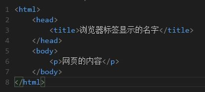
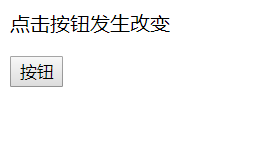
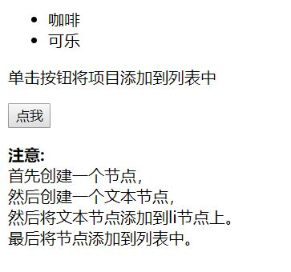
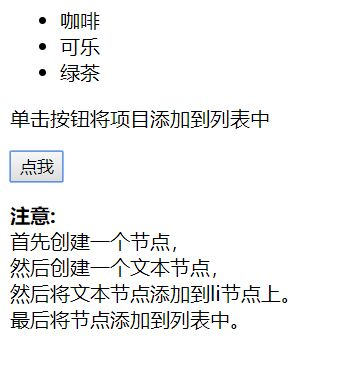

# DOM对象
-----------
## HTML DOM (文件对象模型)
## DOM ：Document Object Model

当网页被加载时，浏览器会创建页面的文档对象模型（Document Object Model），为HTML和XML提供的API。
HTML DOM 模型被构造为对象的树。

### 1.HTML DOM树

### 2.什么是DOM？


-----------
* 可以把DOM看成是节点
* 这个HTML文件是一个网页的基本结构。
* <html>标签是一个节点。
* <head>,<title>,<body>,<p>标签都是节点。
* 用来镶嵌其他节点的称为父节点。
* 被镶嵌的称为子节点。

### 3.DOM有什么用？
* 通过DOM可以改变网页
* 一般用JavaScript来操作dom来改变网页
* 为了使用JavaScript来改变网页，必须告诉js去改变哪一个节点，这就是操作dom。
-----------
### 实例1如下图：

### 点击按钮之后显示如图：


通过点击按钮使文本发生了改变。

### 代码如下：
```html
<!DOCTYPE html>
<html>
<head>
	<title>dom属性实例</title>
	<meta charset="utf-8">
</head>
<body>
<p id="demo">点击按钮发生改变</p>
<button onclick="myFunction()">按钮</button>
<script type="text/javascript">
	function myFunction(){
		document.getElementById('demo').innerHTML="hello dom!";
	}
</script>
</body>
</html>
```
#### 从代码中我们可以看出dom通过访问属性id将文本中的内容改变成“hello dom！”
----------
### 实例2如下图：


### 点击按钮之后显示如图：



我们发现点击按钮之后网页多了一行“绿茶”的列表，网页暂时性的发生了改变。  

### 代码如下：
```html
<!DOCTYPE html>
<html>
<head>
<meta charset="utf-8">
<title>dom元素对象实例</title>
</head>
<body>
<ul id="myList"><li>咖啡</li><li>可乐</li></ul>
<p id="demo">单击按钮将项目添加到列表中</p>
<button onclick="myFunction()">点我</button>
<script>
function myFunction(){
	//创建一个节点
	var node=document.createElement("li");
    //创建一个文本节点
	var textnode=document.createTextNode("绿茶");
	//将文本节点添加到li节点上
	node.appendChild(textnode);
	//将节点（node）添加到myList列表中
	document.getElementById("myList").appendChild(node);
}
</script>
<p><strong>注意:</strong><br>首先创建一个节点，<br> 然后创建一个文本节点，<br>然后将文本节点添加到li节点上。<br>最后将节点添加到列表中。</p>

</body>
</html>

```

根据我在标签中的注释可以清晰的看出通过dom去创建节点并将文本节点添加到li节点上，最终添加到“myList”列表上，从而可以进行该网页操作.

--------


举例解释：DOM就是如果将文档的内容视为一栋办公楼，那DOM就是一种对办公楼内空间分配的标准，它规定了，这个办公楼的空间，应该是先分楼层，再分房间的方式，方便访客找到这个房间。有什么用？
举例说明：你要去一个叫201的房间（获取对象），你怎么去呢? 用DOM的方法，你只需要走到二层，然后到第一个房间就行了，而你是用走，爬，甚至跳舞的方式过去（即：使用不同的编程语言）都没关系，你只要按照DOM的规定，最终都能找到这个房间。全世界的房子都是分楼层，再分房间的结构，于是，你去哪个办公楼找人，你都能通过上某个楼层、按照房间的排列顺序去找到某个房间。同理全世界的网页内容都是DOM的结构，于是，你去找网页中的某个对象时，都能通过某个标签的某个子标签找到某个对象。


--------

* Javascript 不能够真正改变 DOM，它仅仅是改变呈现内容，当你刷新的时候就会发现这怎么什么都还原了。
* 但是你可以把这些改变用请求的方式传递给后端语言接口，由后端语言比如 PHP Python Java Node等来进行后续的操作，它们接到你的请求之后就去修改服务器数据，这样改变就生效了。


* HTML 表达静态结构（网页有哪些元素，每个元素代表什么意义，元素包含了什么内容）
* CSS 呈现美化（元素的颜色，形状，布局）
* Javascript 负责动态交互（操作 DOM，使用 Ajax 进行异步刷新，与服务器交互）


